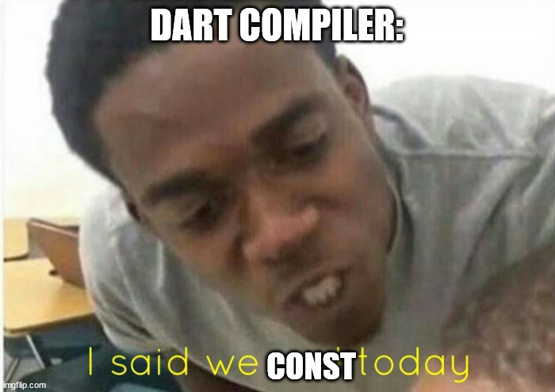

1. SnappingSheetController. It allows the developer to control the sheet position from other widgets.
2. snappingPositions parameter controls tha animations behavior. (snappingCurve and snappingDuration)
3. InkWell provides ripple effect. GestureDetectors provides more gestures (like dragging, etc).

Bad meme:

